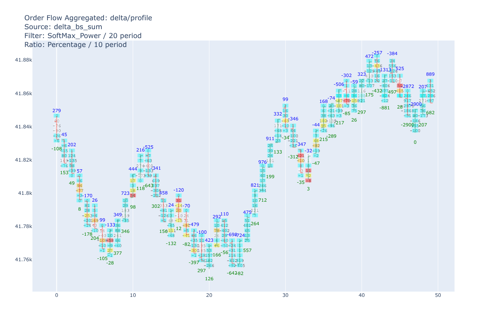
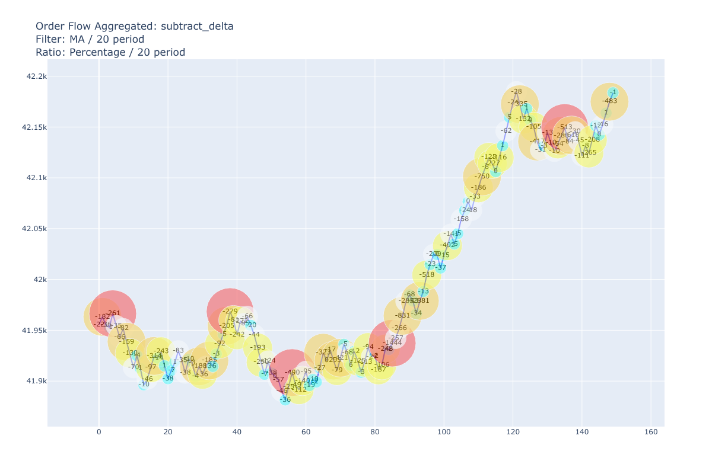
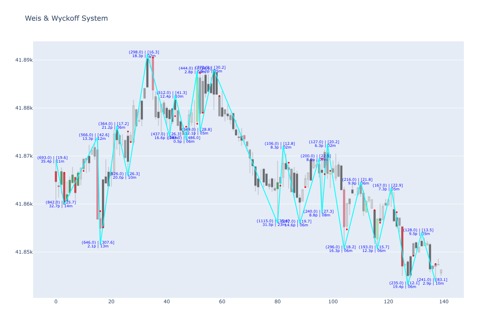

# srl-python-indicators
Python version of [srl-ctrader-indicators](https://github.com/srlcarlg/srl-ctrader-indicators)

**The features of each indicator** are now fully synchronized with C# code. <br>
**The additional features** developed here will be added _(perhaps improved!)_ to C# version soon, at the proper time.

Currently, all indicators are plotted with 'plotly' library, but:
- *multi_vwap* can be plotted with mplfinance
- *tpo_profile/volume_profile* have limited support to plot with mplfinance (ex: no levels)
- *weis_wyckoff_system* no longer uses mplfinance.

See ‘notebooks’ folder for a detailed review of each indicator.


```python
import pandas as pd

df_ticks = pd.read_parquet(f"data/US30_T1_2025_cT.parquet")
df_ticks.rename(columns={'bid': 'close'}, inplace=True)
df_ticks.head(3)
len(df_ticks)

df_ohlcv = pd.read_parquet(f"data/US30_1Minute_2025_cT.parquet")
df_ohlcv.head(3)
len(df_ohlcv)

from rangedf import Range
r = Range(df_ticks, range_size=14)
df_range = r.range_df()

render = 'png'
```


<div>
<table border="1" class="dataframe">
  <thead>
    <tr style="text-align: right;">
      <th></th>
      <th>ask</th>
      <th>close</th>
      <th>spread</th>
    </tr>
    <tr>
      <th>datetime</th>
      <th></th>
      <th></th>
      <th></th>
    </tr>
  </thead>
  <tbody>
    <tr>
      <th>2025-05-15 00:00:00.650</th>
      <td>41839.4</td>
      <td>41838.3</td>
      <td>1.1</td>
    </tr>
    <tr>
      <th>2025-05-15 00:00:01.002</th>
      <td>41839.8</td>
      <td>41838.7</td>
      <td>1.1</td>
    </tr>
    <tr>
      <th>2025-05-15 00:00:01.252</th>
      <td>41840.2</td>
      <td>41839.1</td>
      <td>1.1</td>
    </tr>
  </tbody>
</table>
</div>


    180399


<div>
<table border="1" class="dataframe">
  <thead>
    <tr style="text-align: right;">
      <th></th>
      <th>open</th>
      <th>high</th>
      <th>low</th>
      <th>close</th>
      <th>volume</th>
    </tr>
    <tr>
      <th>datetime</th>
      <th></th>
      <th></th>
      <th></th>
      <th></th>
      <th></th>
    </tr>
  </thead>
  <tbody>
    <tr>
      <th>2025-05-15 00:00:00</th>
      <td>41838.7</td>
      <td>41846.1</td>
      <td>41833.8</td>
      <td>41846.1</td>
      <td>142.0</td>
    </tr>
    <tr>
      <th>2025-05-15 00:01:00</th>
      <td>41845.1</td>
      <td>41853.3</td>
      <td>41843.8</td>
      <td>41852.1</td>
      <td>90.0</td>
    </tr>
    <tr>
      <th>2025-05-15 00:02:00</th>
      <td>41853.5</td>
      <td>41858.6</td>
      <td>41853.5</td>
      <td>41855.1</td>
      <td>96.0</td>
    </tr>
  </tbody>
</table>
</div>


    2631


```python
from order_flow_aggregated import OrderFlowAggregated, SpikePlot
odft = OrderFlowAggregated(df_range, df_ticks, 3, is_open_time=False)

plot_params = SpikePlot(spike_chart=True, spike_levels=False)
odft.plot([50, 100], mode='delta', chart='ohlc', spike_plot=plot_params, renderer=render)
```


    

    


```python
odft.plot_bubbles([350, 500], 'subtract', 'heatmap', renderer=render)
```


    

    


```python
from volume_profile import VolumeProfile, DistributionData, ExtraProfile

vp = VolumeProfile(df_ohlcv, None, 7, pd.Timedelta(hours=12), DistributionData.OHLC_No_Avg)
vp.plot_ly('normal', nodes_source='lvn',
          extra_profile=ExtraProfile.Mini, mini_interval=pd.Timedelta(hours=8),
          renderer=render)
```


    

    


```python
from tpo_profile import TpoProfile

tpo = TpoProfile(df_ohlcv, 7, pd.Timedelta(hours=8))
tpo.plot_ly(nodes_source='hvn', renderer=render)
```


    

    


```python
from multi_vwap import MultiVwap, BandsFilter, BandsType

vwap = MultiVwap(df_ohlcv)
filter = BandsFilter(BandsType.Percentile_Asymmetric, volume_weighted=False)
vwap.plot_ly(bands_at='daily', bands_filter=filter, renderer=render)
```


    

    


```python
from weis_wyckoff_system import WeisWyckoffSystem
from models_utils.ww_models import ZigZagInit, ZigZagMode, PriorityMode

ww = WeisWyckoffSystem()
_zz = ZigZagInit(ZigZagMode.Percentage, pct_value=0.02)
df = ww.full_analysis(df_ohlcv, None, None, zigzag_init=_zz)
df = df.iloc[10:150]
ww.plot(df, bar_time=False, bar_volume=False, turning_point=True, renderer=render)
```


    

    

