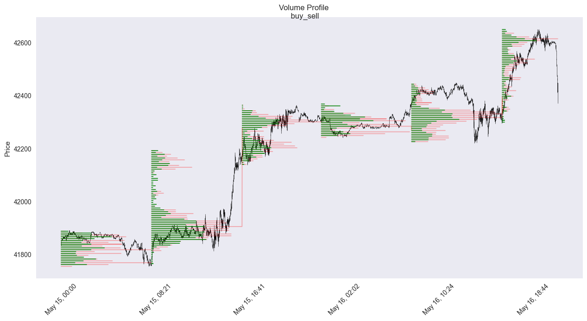
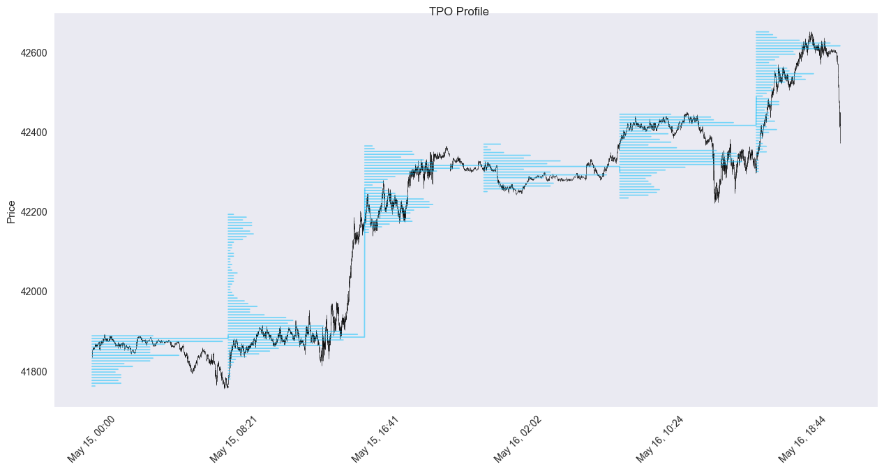
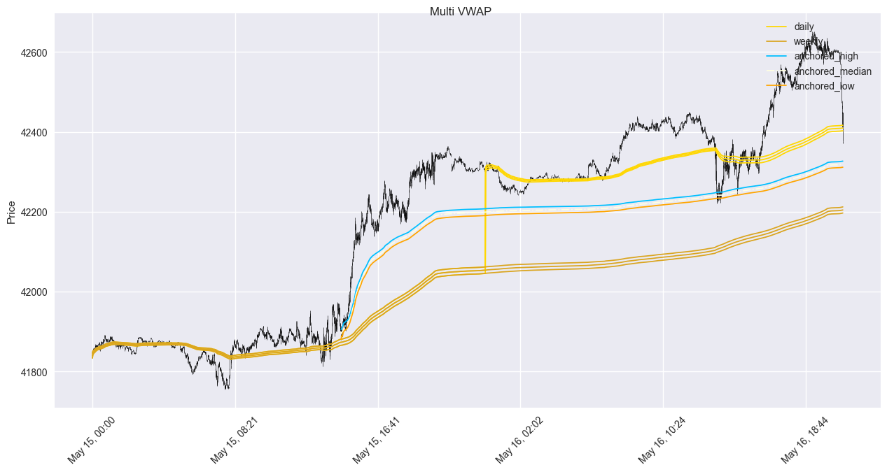
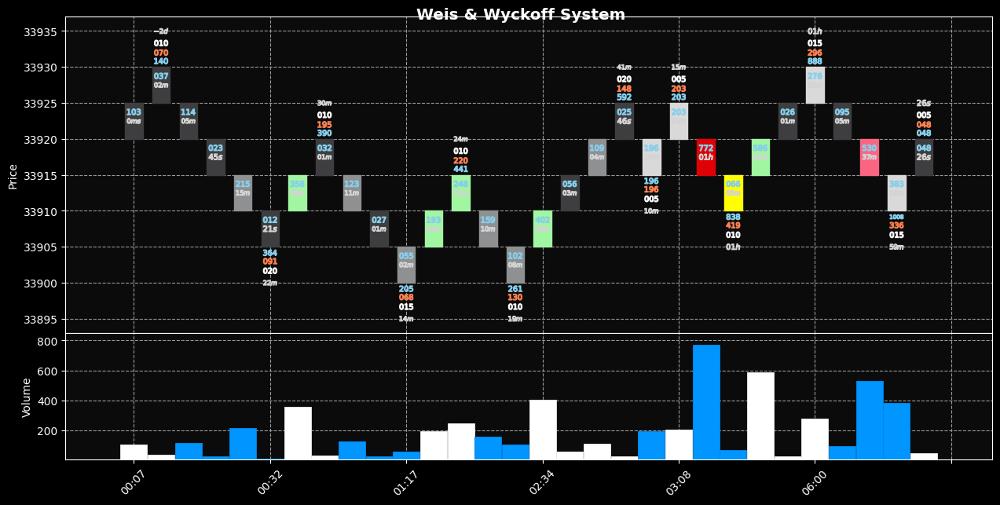
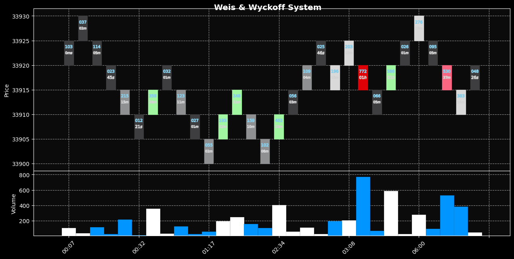
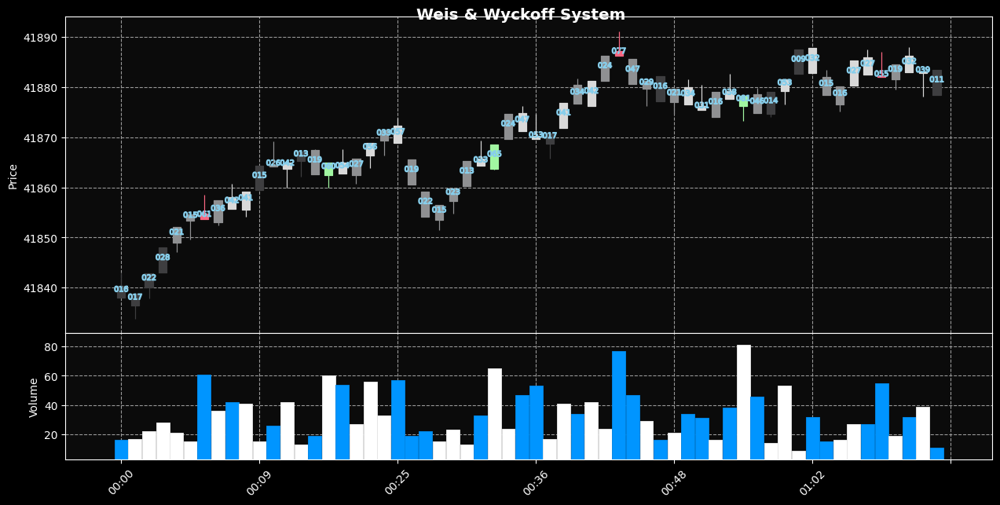

# srl-python-indicators
Python version of the indicators I developed for cTrader trading plataform, with improvements _(paralel processing)_ and additional features compared to C# source code.

Only _**order_flow_ticks**_ and _**order_flow_aggregated**_ are plotted using the **plotly** library, see 'notebooks' folder.

All others are plotted with **mplfinance**.


```python
import pandas as pd
from order_flow_ticks import OrderFlowTicks

df_ticks = pd.read_parquet(f"data/US30_T1_2025_cT.parquet")
df_ticks.rename(columns={'bid': 'close'}, inplace=True)

df_ticks.head(3)
df_ticks.tail(3)
len(df_ticks)
```


<div>
<table border="1" class="dataframe">
  <thead>
    <tr style="text-align: right;">
      <th></th>
      <th>ask</th>
      <th>close</th>
      <th>spread</th>
    </tr>
    <tr>
      <th>datetime</th>
      <th></th>
      <th></th>
      <th></th>
    </tr>
  </thead>
  <tbody>
    <tr>
      <th>2025-05-15 00:00:00.650</th>
      <td>41839.4</td>
      <td>41838.3</td>
      <td>1.1</td>
    </tr>
    <tr>
      <th>2025-05-15 00:00:01.002</th>
      <td>41839.8</td>
      <td>41838.7</td>
      <td>1.1</td>
    </tr>
    <tr>
      <th>2025-05-15 00:00:01.252</th>
      <td>41840.2</td>
      <td>41839.1</td>
      <td>1.1</td>
    </tr>
  </tbody>
</table>
</div>


<div>
<table border="1" class="dataframe">
  <thead>
    <tr style="text-align: right;">
      <th></th>
      <th>ask</th>
      <th>close</th>
      <th>spread</th>
    </tr>
    <tr>
      <th>datetime</th>
      <th></th>
      <th></th>
      <th></th>
    </tr>
  </thead>
  <tbody>
    <tr>
      <th>2025-05-16 20:54:59.640</th>
      <td>42376.7</td>
      <td>42375.6</td>
      <td>1.1</td>
    </tr>
    <tr>
      <th>2025-05-16 20:54:59.841</th>
      <td>42377.1</td>
      <td>42376.0</td>
      <td>1.1</td>
    </tr>
    <tr>
      <th>2025-05-16 20:55:00.000</th>
      <td>42377.9</td>
      <td>42376.8</td>
      <td>1.1</td>
    </tr>
  </tbody>
</table>
</div>


    180399


```python
df_ohlcv = pd.read_parquet(f"data/US30_1Minute_2025_cT.parquet")
df_ohlcv.head(3)
df_ohlcv.tail(3)
len(df_ohlcv)
```


<div>
<table border="1" class="dataframe">
  <thead>
    <tr style="text-align: right;">
      <th></th>
      <th>open</th>
      <th>high</th>
      <th>low</th>
      <th>close</th>
      <th>volume</th>
    </tr>
    <tr>
      <th>datetime</th>
      <th></th>
      <th></th>
      <th></th>
      <th></th>
      <th></th>
    </tr>
  </thead>
  <tbody>
    <tr>
      <th>2025-05-15 00:00:00</th>
      <td>41838.7</td>
      <td>41846.1</td>
      <td>41833.8</td>
      <td>41846.1</td>
      <td>142.0</td>
    </tr>
    <tr>
      <th>2025-05-15 00:01:00</th>
      <td>41845.1</td>
      <td>41853.3</td>
      <td>41843.8</td>
      <td>41852.1</td>
      <td>90.0</td>
    </tr>
    <tr>
      <th>2025-05-15 00:02:00</th>
      <td>41853.5</td>
      <td>41858.6</td>
      <td>41853.5</td>
      <td>41855.1</td>
      <td>96.0</td>
    </tr>
  </tbody>
</table>
</div>


<div>
<table border="1" class="dataframe">
  <thead>
    <tr style="text-align: right;">
      <th></th>
      <th>open</th>
      <th>high</th>
      <th>low</th>
      <th>close</th>
      <th>volume</th>
    </tr>
    <tr>
      <th>datetime</th>
      <th></th>
      <th></th>
      <th></th>
      <th></th>
      <th></th>
    </tr>
  </thead>
  <tbody>
    <tr>
      <th>2025-05-16 20:52:00</th>
      <td>42462.1</td>
      <td>42465.6</td>
      <td>42447.1</td>
      <td>42447.3</td>
      <td>205.0</td>
    </tr>
    <tr>
      <th>2025-05-16 20:53:00</th>
      <td>42447.7</td>
      <td>42449.8</td>
      <td>42412.2</td>
      <td>42414.2</td>
      <td>260.0</td>
    </tr>
    <tr>
      <th>2025-05-16 20:54:00</th>
      <td>42412.5</td>
      <td>42420.4</td>
      <td>42371.4</td>
      <td>42376.0</td>
      <td>399.0</td>
    </tr>
  </tbody>
</table>
</div>


    2631


```python
from volume_profile import VolumeProfile, DistributionData
from tpo_profile import TpoProfile
from multi_vwap import MultiVwap

vp = VolumeProfile(df_ohlcv, None, 7, pd.Timedelta(hours=8), DistributionData.OHLC_No_Avg)
tpo = TpoProfile(df_ohlcv, 7, pd.Timedelta(hours=8))
vwap = MultiVwap(df_ohlcv)
```


```python
vp.plot('buy_sell')
```


    

    


```python
tpo.plot()
```


    

    


```python
vwap.plot('2025-05-15 14:33:00')
```


    

    


```python
df_renko = pd.read_parquet(f"data/2023/US30_Re50_2023_normal.parquet")
from weis_wyckoff_system import WeisWyckoffSystem
ww = WeisWyckoffSystem(df_renko)
ww.plot(iloc_value=30)
```

    Performing Full Analysis...
    Calculating plots...
    Completed! mpf.plot() was called, wait a moment!


    

    


```python
ww.plot_wyckoff(iloc_value=30)
```

    Performing Wyckoff Analysis...
    Calculating plots...
    Completed! mpf.plot() was called, wait a moment!


    

    


```python
from rangedf import Range
r = Range(df_ticks, range_size=5)
ww = WeisWyckoffSystem(r.range_df())
ww.plot_wyckoff(60, plot_time=False)
```

    Performing Wyckoff Analysis...
    Calculating plots...
    Completed! mpf.plot() was called, wait a moment!


    

    

